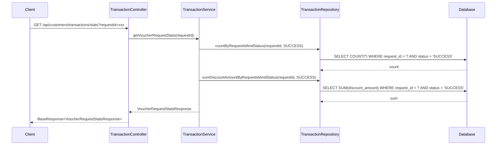

# Tài liệu Thiết kế: Voucher Request Statistics API

## Tổng quan

Tính năng này mở rộng `customer-service` để hỗ trợ thống kê theo đợt phát voucher. Thiết kế bao gồm hai phần chính:

1. **Mở rộng data model**: Thêm trường `requestId` vào entity `Transaction` để liên kết giao dịch với đợt phát voucher.
2. **API thống kê**: Endpoint mới trả về số lượng voucher đã dùng và tổng tiền giảm giá cho một `requestId` cụ thể.

API tuân theo kiến trúc phân lớp hiện có (Controller → Service → Repository → Entity) và sử dụng `BaseResponse` wrapper cho response.

## Kiến trúc



### Quyết định thiết kế

1. **Đặt API trong customer-service**: Vì dữ liệu Transaction nằm trong customer-service, API thống kê cũng sẽ nằm ở đây thay vì tạo cross-service call.
2. **Sử dụng JPA query methods**: Tận dụng Spring Data JPA derived queries và `@Query` annotation cho các truy vấn aggregate (COUNT, SUM) thay vì native query.
3. **Tối ưu bằng single query**: Có thể gộp COUNT và SUM thành một query duy nhất bằng JPQL projection để giảm round-trip đến database.

## Thành phần và Giao diện

### 1. Transaction Entity (mở rộng)

Thêm trường `requestId` vào entity hiện có:

```java
@Column(name = "request_id", length = 64)
private String requestId;
```

- Nullable: cho phép null vì không phải giao dịch nào cũng dùng voucher
- Index: tạo index trên cột `request_id` để tối ưu truy vấn thống kê

### 2. TransactionRepository (mở rộng)

Thêm method truy vấn thống kê:

```java
@Query("SELECT new com.example.customerservice.dto.response.VoucherRequestStatsResponse(" +
       "COUNT(t), COALESCE(SUM(t.discountAmount), 0)) " +
       "FROM Transaction t " +
       "WHERE t.requestId = :requestId AND t.status = :status")
VoucherRequestStatsResponse getStatsByRequestIdAndStatus(
    @Param("requestId") String requestId,
    @Param("status") Transaction.TransactionStatus status);
```

### 3. TransactionService (mở rộng)

Thêm method mới vào interface:

```java
VoucherRequestStatsResponse getVoucherRequestStats(String requestId);
```

### 4. TransactionController (mở rộng)

Thêm endpoint mới:

```java
@GetMapping("/stats")
@PreAuthorize("hasRole('ADMIN')")
public ResponseEntity<BaseResponse<VoucherRequestStatsResponse>> getVoucherRequestStats(
    @RequestParam String requestId);
```

### 5. VoucherRequestStatsResponse (mới)

DTO response cho API thống kê.

## Mô hình Dữ liệu

### Transaction (mở rộng)

| Trường | Kiểu | Mô tả |
|--------|------|--------|
| requestId | String(64) | Mã đợt phát voucher, nullable, có index |

### VoucherRequestStatsResponse

| Trường | Kiểu | Mô tả |
|--------|------|--------|
| usedVoucherCount | Long | Số lượng voucher đã dùng (giao dịch SUCCESS) |
| totalDiscountAmount | BigDecimal | Tổng tiền giảm giá |

### Database Migration

Cần thêm migration script:

```sql
ALTER TABLE transactions ADD COLUMN request_id VARCHAR(64);
CREATE INDEX idx_transactions_request_id ON transactions(request_id);
```


## Correctness Properties

*Một property là một đặc điểm hoặc hành vi phải luôn đúng trong mọi lần thực thi hợp lệ của hệ thống — về bản chất, đó là một phát biểu hình thức về điều hệ thống phải thực hiện. Properties đóng vai trò cầu nối giữa đặc tả dễ đọc cho con người và đảm bảo tính đúng đắn có thể kiểm chứng bằng máy.*

### Property 1: Transaction requestId assignment

*For any* transaction, nếu giao dịch sử dụng voucher thuộc một đợt phát (có requestId), thì trường `requestId` của transaction phải bằng requestId của đợt phát đó. Nếu giao dịch không sử dụng voucher, trường `requestId` phải là null.

**Validates: Requirements 1.2, 1.3**

### Property 2: Statistics calculation correctness

*For any* requestId và bất kỳ tập hợp transactions nào trong database, API thống kê phải trả về:
- `usedVoucherCount` bằng đúng số lượng transactions có `requestId` khớp VÀ `status = SUCCESS`
- `totalDiscountAmount` bằng đúng tổng `discountAmount` của các transactions có `requestId` khớp VÀ `status = SUCCESS`

Khi không có transaction nào khớp, kết quả phải là `usedVoucherCount = 0` và `totalDiscountAmount = 0`.

**Validates: Requirements 2.1, 2.2, 2.3, 3.2**

### Property 3: Invalid requestId validation

*For any* chuỗi rỗng hoặc chuỗi chỉ chứa whitespace được gửi làm `requestId`, API phải trả về lỗi HTTP 400 và không thực hiện truy vấn thống kê.

**Validates: Requirements 3.1**

## Xử lý Lỗi

| Tình huống | HTTP Status | Error Code | Mô tả |
|-----------|-------------|------------|--------|
| requestId rỗng hoặc thiếu | 400 | INVALID_REQUEST_ID | requestId không được để trống |
| Không có quyền ADMIN | 403 | ACCESS_DENIED | Handled by Spring Security |
| Lỗi hệ thống (DB unavailable) | 500 | INTERNAL_ERROR | Lỗi hệ thống, vui lòng thử lại |

Xử lý lỗi sử dụng pattern `BaseException` hiện có trong project:

```java
throw BaseException.builder()
    .httpStatus(HttpStatus.BAD_REQUEST)
    .errorCode("INVALID_REQUEST_ID")
    .description("requestId không được để trống")
    .build();
```

## Chiến lược Testing

### Unit Tests

- Test validation logic: requestId rỗng, null, whitespace
- Test service layer: verify correct repository method calls
- Test response mapping: verify DTO fields populated correctly

### Property-Based Tests

Sử dụng thư viện **jqwik** (property-based testing cho Java/JUnit 5):

- Mỗi property test chạy tối thiểu 100 iterations
- Mỗi test được annotate với property reference từ design document
- Format tag: **Feature: voucher-request-stats, Property {number}: {property_text}**

**Property test 1**: Tạo random list các Transaction objects (mix SUCCESS/FAILED/PENDING, mix requestIds), lưu vào database, gọi repository method, verify count và sum chỉ tính SUCCESS transactions với requestId khớp.

**Property test 2**: Tạo random strings gồm whitespace characters, verify API trả về 400 cho tất cả.

### Integration Tests

- Test full API flow với Spring Boot test context
- Test authorization: ADMIN role được phép, các role khác bị từ chối
- Test với database thực (H2 in-memory) để verify query correctness
